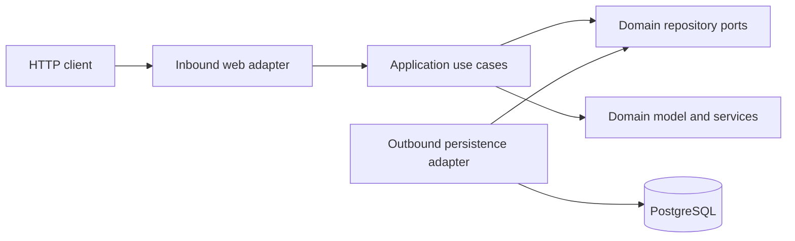

# Video Recommendation Engine

A Spring Boot 3.5 / Java 26 service that exposes a hexagonal, framework-free
recommendation core for videos. The domain has no Spring, JPA, or web imports.

## Architecture

Dependencies point inward: web adapters depend on concrete application use
cases, persistence adapters implement framework-free domain repository ports,
and application use cases depend on the domain. The domain depends only on the
JDK. Use cases and domain services are concrete classes; interfaces are reserved
for external boundaries and domain strategy abstractions.



## Package structure

```text
com.contentdiscovery.recommendation
├── domain
│   ├── model
│   ├── port                 # repository boundaries
│   ├── service              # pure recommendation logic
│   ├── valueobject
│   └── exception
├── application
│   └── usecase              # concrete classes with execute methods
└── infrastructure
    ├── adapter/in/web       # controllers, DTOs, mappers
    ├── adapter/out/persistence
    │   ├── entity           # JPA entities
    │   ├── repository       # Spring Data repositories
    │   └── mapper
    └── configuration
```

* `domain/model`, `domain/service`, `domain/valueobject`, `domain/exception`:
  pure recommendation model, scoring, candidate generation, ranking, and errors.
* `domain/port`: framework-free repository ports (`UserRepository`,
  `VideoRepository`, and `UserInteractionRepository`) representing external
  persistence boundaries.
* `application/usecase`: concrete `GetRecommendations` and
  `RegisterUserInteraction` classes with `execute` methods. They intentionally
  have no use-case or service interfaces.
* `infrastructure/adapter/in/web/{controller,dto,mapper}`: REST boundary and
  validation.
* `infrastructure/adapter/out/persistence/{entity,repository,mapper}`:
  PostgreSQL/JPA implementation, kept separate from domain objects.

## Recommendation algorithm

Interaction history builds a preference profile from positive signals (LIKE,
SHARE, COMMENT, VIEW), while DISLIKE videos are always excluded. Candidate
generation is a composable `CandidateGenerator` port: personalized, tag,
popular, and recent strategies are registered independently and merged by the
domain engine. Adding a strategy does not require changing the engine.

`RecommendationScorer` uses:

`category .25 + tag .20 + watch .20 + popularity .10 + recency .10 + engagement .15`

The watch term is based on normalized watch duration
`min(watchDuration / videoDuration, 1)` from the user's history, aggregated for
matching categories and tags. `VideoRanker` applies deterministic ordering,
excludes watched/disliked videos, and caps each creator and category at two
items while alternatives are available. Candidate retrieval is paginated in the
database (active videos ordered by popularity and publication date), never by
loading the entire catalog.

### Indexing decisions

* `videos(active, popularity_score DESC)` supports the default candidate page.
* `videos(active, created_at DESC)` supports recent-candidate retrieval and
  keeps the recency access path selective.
* `videos(category)` supports category-oriented filtering and future generators.
* `user_interactions(user_id, created_at DESC)` supports the bounded recent
  history read used for every recommendation request.
* `user_interactions(video_id)` supports interaction/video lookups and cleanup.

## Running

Requirements: Java 26 and Maven 3.9+. The default local profile uses a file-based
H2 database, so Docker and PostgreSQL are not required for local development.

```shell
mvn spring-boot:run
```

H2 stores data under `./data/recommendation.*`. Flyway uses the H2-compatible
migrations in `db/migration-h2` to create the indexed tables and realistic seed
data on startup. The H2 console is available at
`http://localhost:8080/h2-console`, using JDBC URL
`jdbc:h2:file:./data/recommendation`.

To use PostgreSQL instead:

```shell
docker compose up -d
mvn spring-boot:run -Dspring-boot.run.profiles=postgres
```

The PostgreSQL profile reads `DB_HOST`, `DB_PORT`, `DB_NAME`, `DB_USERNAME`, and
`DB_PASSWORD` from the environment and uses the PostgreSQL migrations in
`db/migration-postgres`.

## API

* `GET /api/v1/users/{userId}/recommendations?limit=20`
* `POST /api/v1/users/{userId}/interactions`

Example interaction (the application assigns `id` and `createdAt`):

```json
{"videoId":"video-java26","type":"LIKE","watchDuration":"PT15M"}
```

OpenAPI is available at `/swagger-ui.html` and `/v3/api-docs`.

## Tests

```shell
mvn test
```

Unit tests cover scoring, preference calculation, diversity, and application
orchestration. ArchUnit protects the dependency boundaries. The optional
Testcontainers PostgreSQL test runs when `RUN_TESTCONTAINERS=true`.

## Future evolution

Add cursor pagination, event-driven interaction ingestion, cached feature
profiles, collaborative filtering, A/B-tested weights, explanations, metrics,
authentication, and a separate offline feature store behind new ports.
