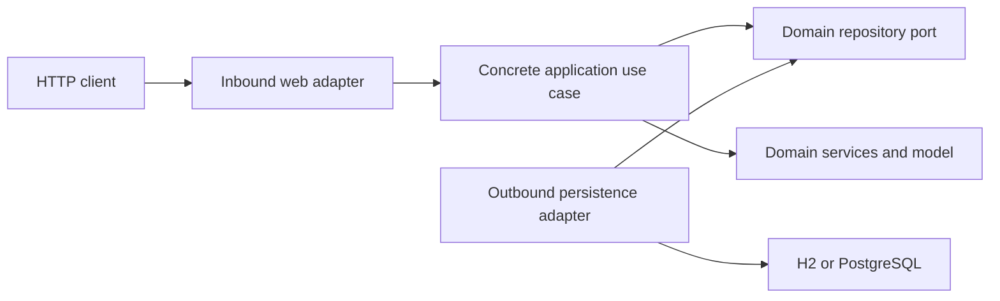

# Technical Architecture

## 1. Overview

`recommendation-engine` is a video recommendation backend based on hexagonal
architecture, also known as Ports and Adapters.

The technical request flow is:

```text
HTTP
  ↓
Inbound web adapter
  ↓
Concrete application use case
  ↓
Domain ports and services
  ↓
Outbound persistence adapter
  ↓
H2 or PostgreSQL
```

The domain knows nothing about Spring, JPA, HTTP, Hibernate, or any database.
Recommendation behavior is described in
[`README_BUSINESS.md`](README_BUSINESS.md).

## 2. Hexagonal dependency direction

Technical dependencies point toward the domain. Ports belong to the side that
requires the dependency, and adapters are responsible for implementing them.

The application depends on framework-free domain ports and services. Inbound
adapters invoke application use cases, while outbound adapters implement the
ports. The domain and application do not depend on infrastructure.

## 3. Project organization

```text
com.contentdiscovery.recommendation
├── domain
│   ├── model
│   ├── port
│   ├── service
│   ├── valueobject
│   └── exception
├── application
│   └── usecase
└── infrastructure
    ├── adapter
    │   ├── in/web
    │   └── out/persistence
    └── configuration
```

### Domain

Contains framework-independent Java classes, including:

- `User`
- `Video`
- `UserInteraction`
- `Recommendation`
- `InteractionType`
- `UserId`
- `VideoId`
- `RecommendationEngine`
- `PreferenceProfile`
- `RecommendationScorer`
- `VideoRanker`

The domain contains the recommendation model and services. Their business
behavior is documented in [`README_BUSINESS.md`](README_BUSINESS.md).

### Application

The use cases are located in `application.usecase`:

- `GetRecommendations`
- `RegisterUserInteraction`

Each use case is a concrete class exposing an `execute(...)` method. Use cases
and services intentionally have no interfaces, following the pattern used in
`hexagonal-ddd-ecommerce-api`.

### Infrastructure

The infrastructure layer contains:

- REST controllers
- DTOs
- Mappers
- JPA entities
- Spring Data repositories
- Persistence adapters
- Bean configuration
- H2 and PostgreSQL integration

## 4. Concrete use cases

`RecommendationController` receives `userId` and `limit`, validates the
parameters, converts the identifier into a `UserId`, and invokes the concrete
use case directly:

```java
getRecommendations.execute(new UserId(userId), limit);
```

The controller does not access repositories and contains no recommendation
logic.

`GetRecommendations` performs the following application orchestration:

1. Validates the limit between 1 and 100.
2. Loads the user through `UserRepository`.
3. Loads the latest 500 interactions.
4. Retrieves the identifiers of videos already interacted with.
5. Requests a paginated candidate page from `VideoRepository`.
6. Loads videos related to the interaction history.
7. Delegates profile construction and recommendation processing to the domain.
8. Returns the recommendations in sorted order.

The requested candidate page is approximately `max(50, limit * 8)` and is
capped at 500. Pagination prevents the entire catalog from being loaded into
memory.

`InteractionController` validates the interaction request and invokes:

```java
registerUserInteraction.execute(
    userId,
    videoId,
    type,
    watchDuration
);
```

`RegisterUserInteraction` checks that the user and video exist, validates the
duration, generates a UUID and `createdAt`, and persists the interaction
through `UserInteractionRepository`. It does not know whether the
implementation uses H2, PostgreSQL, or another technology.

## 5. Domain ports

The persistence ports are located in `domain.port`:

- `UserRepository`
- `VideoRepository`
- `UserInteractionRepository`

These interfaces represent external dependencies. Persistence adapters
implement them, keeping repository technology outside the domain.

## 6. Infrastructure adapters

Inbound web adapters contain the REST controllers, request/response DTOs,
validation, and web mappers under `infrastructure.adapter.in.web`.

Outbound persistence adapters contain the adapter implementations, JPA
entities, Spring Data repositories, and persistence mappers under
`infrastructure.adapter.out.persistence`.

Spring Data repositories are used only within the infrastructure layer.

## 7. Persistence mapping

Persistence entities are independent of the domain:

- `UserEntity`
- `VideoEntity`
- `UserInteractionEntity`

Mappers explicitly convert between:

```text
Domain model ↔ JPA entity
```

This prevents JPA annotations and persistence concerns from leaking into
domain objects.

## 8. Bean configuration

`BeanConfiguration` registers:

- `RecommendationEngine`
- `RecommendationScorer`
- `VideoRanker`
- Candidate strategies
- `GetRecommendations`
- `RegisterUserInteraction`

Controllers receive concrete use cases through constructor injection:

```text
Controller
  → Concrete Use Case
  → Domain Repository Port
  → Persistence Adapter
```

## 9. Local H2 and PostgreSQL

### Local H2

The default configuration uses:

```text
jdbc:h2:file:./data/recommendation
```

Start it with:

```shell
mvn spring-boot:run
```

H2 migrations are located in:

```text
src/main/resources/db/migration-h2
```

The console is available at:

```text
http://localhost:8080/h2-console
```

### PostgreSQL

Enable PostgreSQL through the `postgres` profile:

```shell
docker compose up -d
mvn spring-boot:run -Dspring-boot.run.profiles=postgres
```

PostgreSQL migrations are located in:

```text
src/main/resources/db/migration-postgres
```

The connection uses:

```text
DB_HOST
DB_PORT
DB_NAME
DB_USERNAME
DB_PASSWORD
```

## 10. Error handling

`GlobalExceptionHandler` transforms exceptions into consistent HTTP
responses. For example:

```json
{
  "timestamp": "2026-09-04T12:00:00Z",
  "status": 404,
  "code": "USER_NOT_FOUND",
  "message": "User not found",
  "path": "/api/v1/users/user-1/recommendations"
}
```

The following are handled:

- Nonexistent user
- Nonexistent video
- Invalid limits
- Malformed JSON
- Invalid interaction types
- Missing parameters
- Validation errors

## 11. Tests and architecture

The project contains:

- Domain unit tests.
- Use-case unit tests with Mockito.
- Architecture tests with ArchUnit.
- An optional integration test with Testcontainers and PostgreSQL.

ArchUnit verifies that:

- The domain does not depend on Spring or JPA.
- The domain does not depend on infrastructure.
- The application does not depend on infrastructure.
- Controllers do not access repositories.
- Adapters implement domain ports.
- JPA entities reside within infrastructure.

## 12. Architecture diagram



For recommendation rules and end-to-end domain behavior, see
[`README_BUSINESS.md`](README_BUSINESS.md).
